# 作成物メモ
## R☆AI☆NNER
足圧センサーを用いたスマートインソール

走り方を改善することを目的としている。センサーデータをDeep Learningを用いて解析し、着地方法を分類することで、良い走り方なのかそうでないのかを判別する。

福野さんに紹介してもらった記事 → https://fukuno.jig.jp/3565

Raspberry Pi zero w 側のソースコード https://github.com/pond-e/dcon

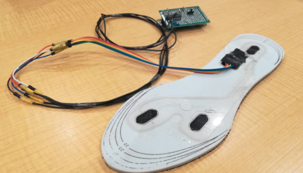

## BgGapFiller
デバイスのサイズに合っていない背景画像に単色の背景を足してサイズを合わせてくれるWebアプリ「BgGapFiller」

iPhone SE用の画像を作ると左の画像から右の画像が生成されます (枠はスマートフォンのイメージ)

https://bggapfiller.onrender.com

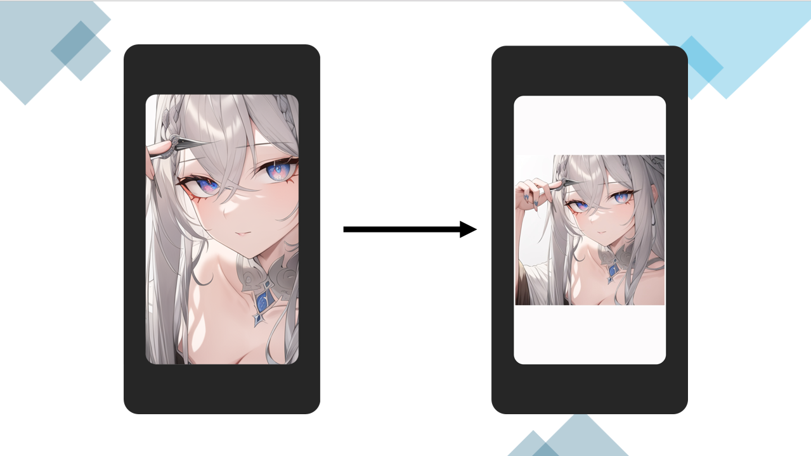


## Temペット
古いエアコンをスマートに、ペットに最適な環境を提供するリモートリモコン型デバイス「Temペット」

https://elchika.com/article/f071bcac-4171-43c5-ac84-83035b03fcfb/

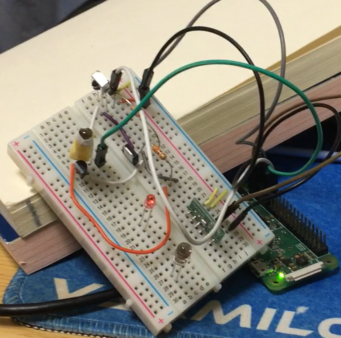

## 食堂売り切れ管理 Webアプリ
PHP と Postgresql を使ったフルスタック Web アプリ

https://github.com/pond-e/akashi_shokudou

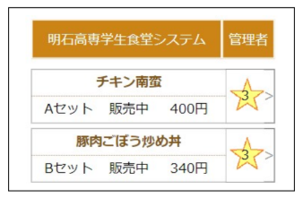

## Clustream を使ったストリーミング処理のデモアプリ

ストリーミング用クラスタリングアルゴリズムに Clustream、データストリーム処理に Apache Flink を使った tweet リアルタイムレコメンデーションシステム

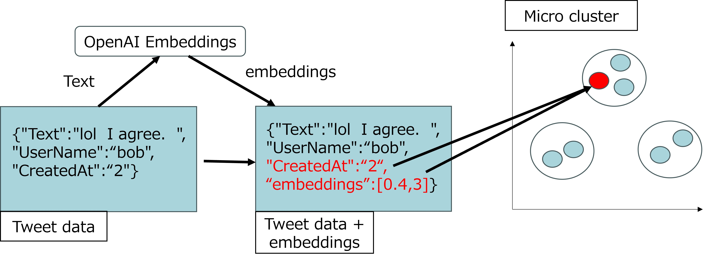

## 転移学習を用いた橋梁認識システム デモアプリ

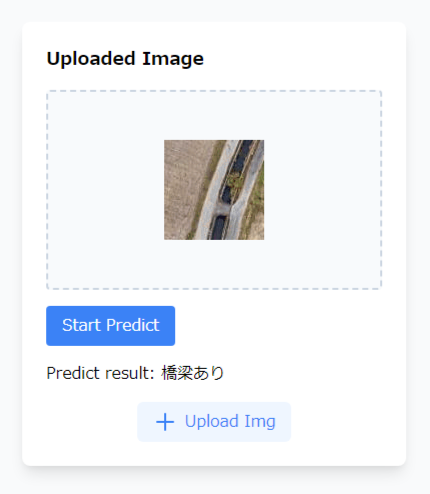

## MyDisassembler
https://github.com/pond-e/MyDisassembler

```
$ go run . sample_asm_3
.text
mov eax, [ebx]
$ go run . sample_asm_3_win64.exe
mov eax, [ebx]
```

## 2Dアクションゲーム Gem
https://unityroom.com/games/kusoge-d

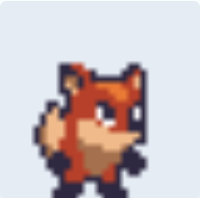


## mod計算体験ゲーム Siv3D
https://pond-e.github.io/web_ceasar_cipher_game/cipher_ceasar_game.html

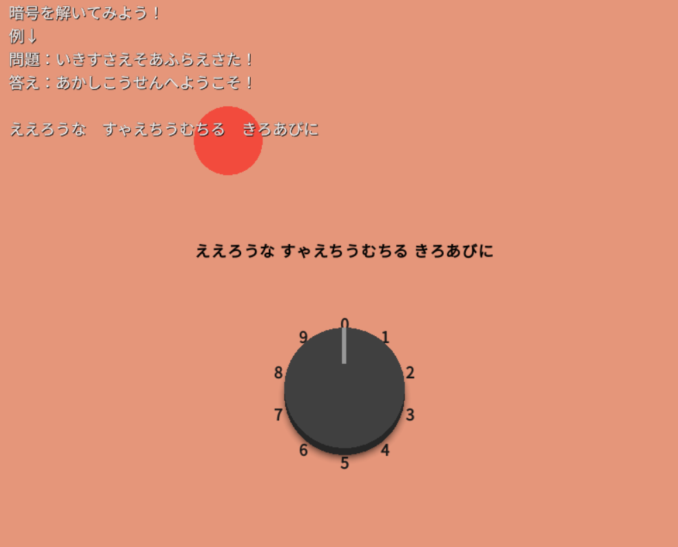


## Useless Box
https://qiita.com/pond-e/items/a5caab5f3042e1755b19

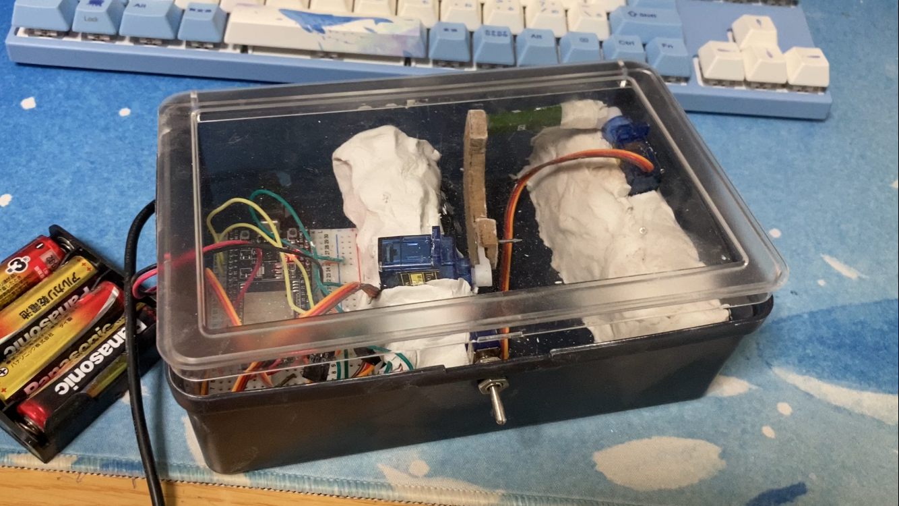


## RAG Chat Bot (ExSeed)

Azure AI Search と OpenAI Embedding, Gradio を使って RAG Chat Bot を作りました


## CanSat 2020
缶サット甲子園 和歌山大会

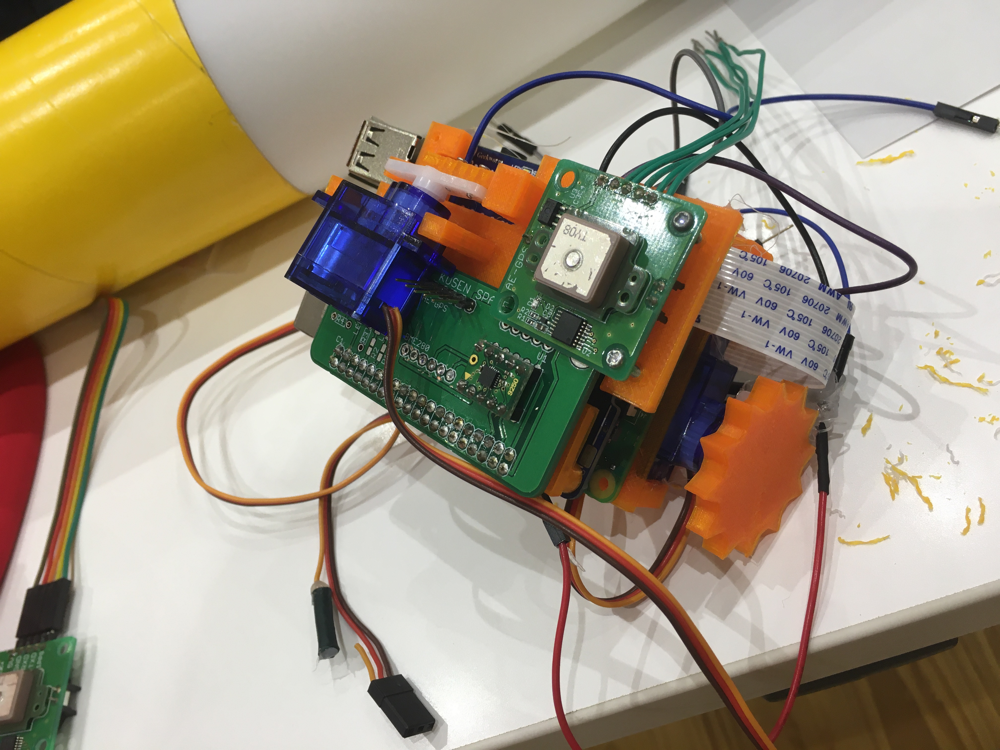
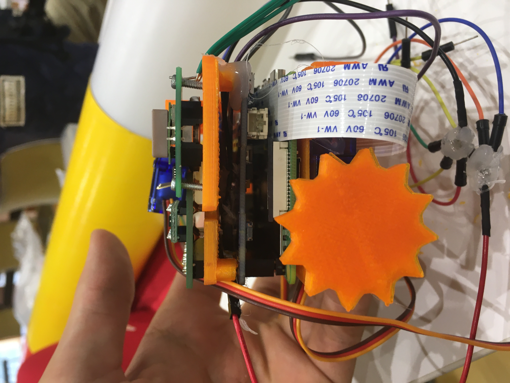

## CanSat 2024
NSE, ARLISS, 種子島ロケットコンテスト フルサクセス 敢闘賞


## IMU 姿勢推定システム in Unity

https://zenn.dev/pond6814/articles/8ba1b37cf207d8

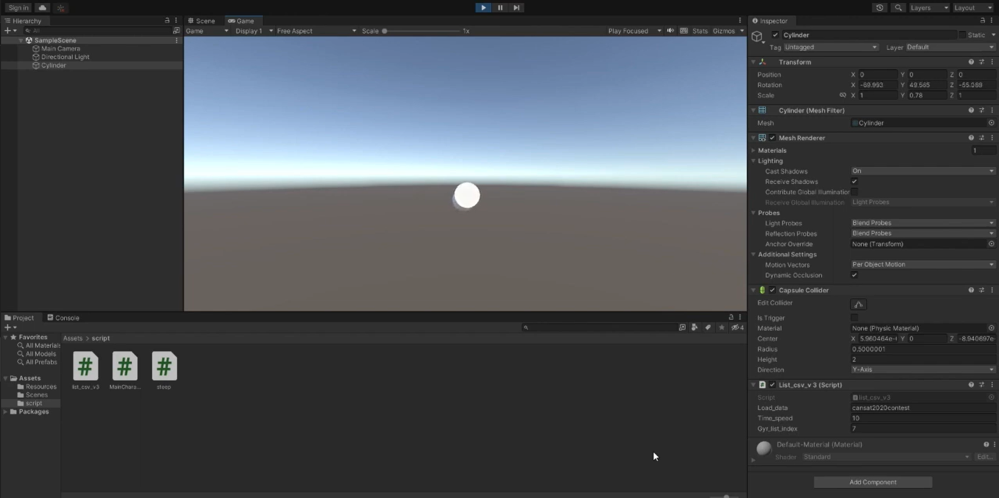

## アルコールセンサー

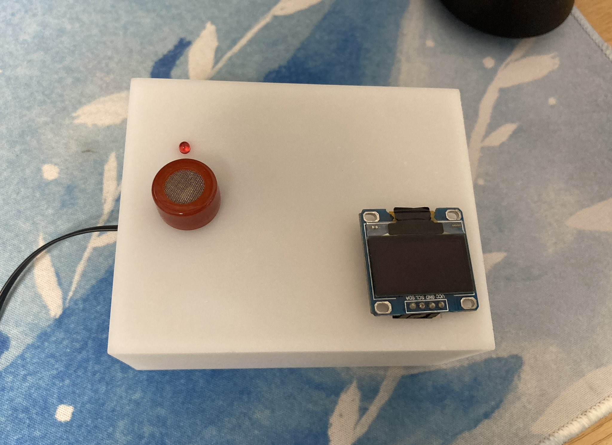

## Discord clone

## Read ELF

ELF ファイルの情報を取得するツール

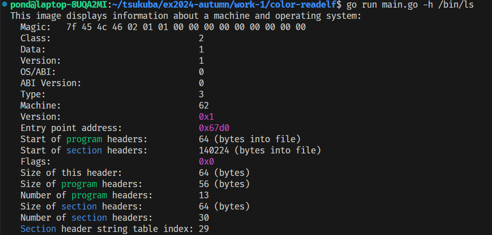

## JS 簡易難読化器

JavaScript を難読化するツール

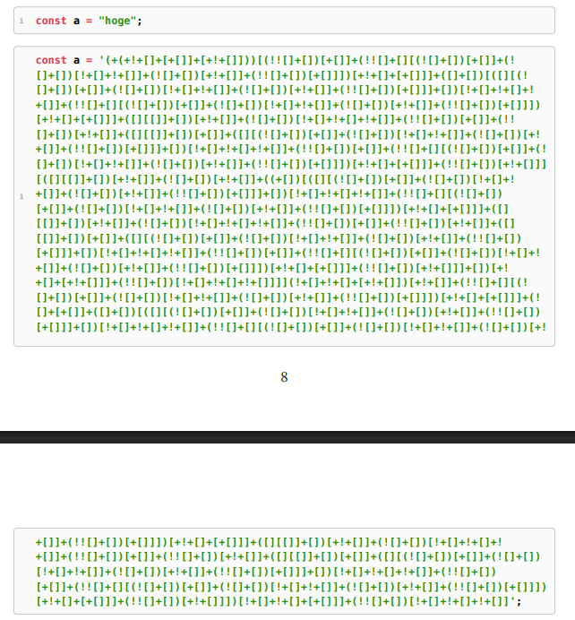
